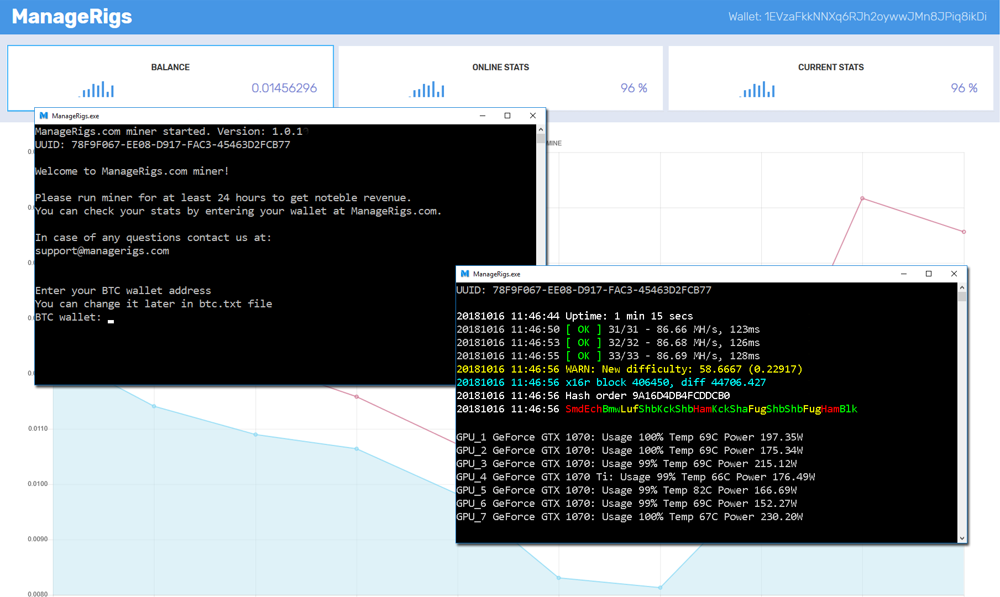

# ManageRigs Miner Control App

## [Download here](https://github.com/ManageRigs/minercontrol/releases)

# 
[ManageRigs](https://managerigs.com/) Miner Control App is an application that increases the income of your mining rigs. Earn more than [WhatToMine.com](https://whattomine.com/) predicts.
We manage your rigs and mining-related processes. Safely, remotely, effectively.
Weekly payments, reports.

- [Introduction](#introduction)
- [Who are we?](#whoarewe)
- [How do we do that?](#how)
- [What about payments?](#payments)
- [What do I need to start?](#start)
- [How to report bugs and issues?](#bugs)

#  Who are we?

A team of developers and miners, which developed a product that maximizes mining profits.

#  How do we do that?

- automatic switching between profitable currencies and algos
- algorythmic trading to gain maximum profit
- stop loss protection
- uninterruptable operation provided by 24/7 monitoring
- and more

#  What about payments?

BTC payments directly to your wallet every Monday. You have access to income stats, updated every day.

#  What do I need to start?

- Download [our miner app](https://github.com/ManageRigs/minercontrol/releases/) from github
- Extract zip archive
- Run ManageRigs.exe
- For the first time you will be asked for your btc payout address, you can change it later in btc.txt file.
- You will receive Bitcoin payments according to our payments schedule and get access link to your stats webpage inside the app.

#  How to report bugs and issues?

To report bugs and issues please use the GitHub issue reporting tool: https://github.com/ManageRigs/minercontrol/issues. Any bugs and issues reports are very much appreciated since it helps us to improve. Thank you.
